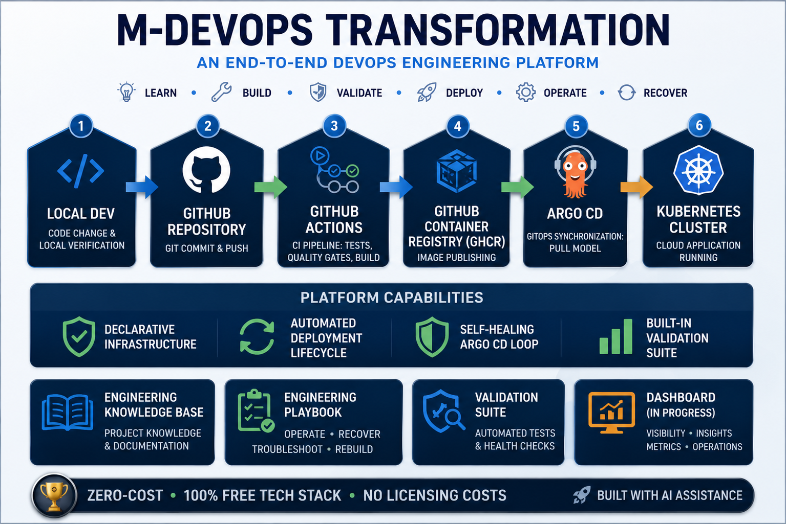

# M-DevOps Transformation

# Engineering Documentation Portal

> **From Local Development to GitOps Deployment**

---



---

## Welcome

Welcome to the official **Engineering Documentation Portal** of the **M-DevOps Transformation** project.

This portal is the central entry point for all engineering documentation.

Whether you want to understand the architecture, rebuild the platform, operate the system or troubleshoot a deployment, this portal will guide you to the appropriate documentation.

---

# Engineering Lifecycle

The platform follows a complete engineering lifecycle.

```text
📘 Learn
      ↓
🛠 Build
      ↓
✅ Validate
      ↓
🚀 Deploy
      ↓
⚙ Operate
      ↓
🚨 Recover
```

Every phase is documented and reproducible.

---

# Choose Your Starting Point

| I want to... | Start here |
|---|---|
| 📘 Learn how the platform works | [Engineering Playbook](playbook/README.md) |
| 🛠 Build or rebuild the platform | [Engineering Playbook](playbook/README.md) |
| ⚙ Operate the platform | [Engineering Playbook](playbook/README.md) |
| 🚨 Troubleshoot a problem | [Engineering Playbook](playbook/README.md) |
| ❓ Find documentation by question | [Documentation Navigator](playbook/Playbook_Navigation_Guide.md) |

---

# Engineering Resources

## 📖 Engineering Playbook

The operational documentation of the platform.

Contains:

- Architecture
- Golden Path
- Rebuild Guides
- Operations
- Troubleshooting
- Recovery

➡ **[Open Engineering Playbook](playbook/README.md)**

---

## 📚 Engineering Knowledge Base

Engineering knowledge collected during the implementation.

Includes:

- Handbook
- Standards
- Cheat Sheets
- Engineering Decisions

Repository folders:

- `handbook/`
- `standards/`
- `cheat_sheets/`

---

## 📈 Engineering Reports

Historical project documentation.

Includes:

- Epic Reports
- Transition Reports
- Retrospectives

Repository folder:

- `reports/`

---

# Documentation Philosophy

The documentation is organized around engineering workflows instead of repository folders.

The goal is to answer engineering questions quickly, for example:

- How do I rebuild the platform?
- How does GitOps work?
- How does a Docker image reach Kubernetes?
- Why is my Pod not starting?
- How do I validate the platform?
- Where should I begin?

---

# Documentation Navigator

Looking for something specific?

The Documentation Navigator provides a question-based entry point into the complete Playbook.

➡ **[Open Documentation Navigator](playbook/Playbook_Navigation_Guide.md)**

---

# Engineering Principles

The Engineering Documentation Portal follows five core principles.

- Understandable
- Repeatable
- Recoverable
- Maintainable
- Operational

---

# Platform Status

| Component | Status |
|---|---|
| Engineering Platform | ✅ Complete MVP |
| Engineering Knowledge Base | ✅ Available |
| Engineering Playbook | ✅ Available |
| Engineering Documentation Portal | 🚧 In Progress |
| Dashboard | 🚧 In Progress |
| Notebook Rebuild Validation | ⏳ Planned |

---

# Repository Structure

    docs/
    │
    ├── README.md
    ├── _config.yml
    ├── assets/
    ├── playbook/
    ├── handbook/
    ├── reports/
    ├── standards/
    ├── cheat_sheets/
    └── prompts/

---

**Portal Version:** 1.0

---

© 2026 M-DevOps Transformation

**Engineering Documentation Portal**