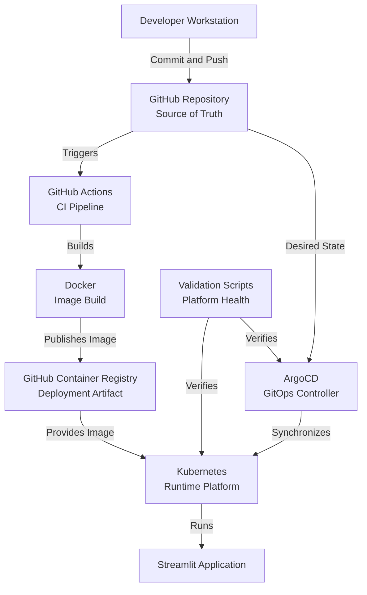

# Platform Architecture Overview

## Purpose

This document provides a high-level architectural overview of the M-DevOps platform.

Its purpose is to help engineers understand how the platform components interact before studying implementation details, operational procedures, or troubleshooting guides.

This document intentionally focuses on architecture and responsibilities rather than implementation steps.

---

# Architecture Goals

The platform was designed to achieve the following objectives:

- Automated software delivery
- Reproducible deployments
- Git-based change management
- Containerized application execution
- Automated validation
- Simplified operational management
- Continuous synchronization between desired and actual system state

The architecture follows modern DevOps and GitOps principles.

---

# High-Level Architecture



The architecture separates software development, artifact creation, deployment control, runtime execution, and platform validation.

---

# Component Responsibilities

## Developer Workstation

Purpose:

- Application development
- Local testing
- Source code management
- Validation before commit

Primary tools:

- Windows 11
- Visual Studio Code
- PowerShell
- Python
- Python virtual environment
- Docker Desktop
- Git

---

## GitHub Repository

Purpose:

- Act as the single source of truth
- Store version-controlled engineering artifacts
- Support collaboration and review
- Trigger automated workflows

The repository stores:

- Application source code
- Automated tests
- Docker configuration
- CI/CD configuration
- Kubernetes and GitOps configuration
- Validation scripts
- Engineering documentation

---

## GitHub Actions

Purpose:

- Perform continuous integration
- Validate engineering changes
- Build deployment artifacts
- Publish container images

Key responsibilities:

- Ruff linting
- Bandit security scanning
- pytest execution
- Docker image build
- GHCR publication

---

## Docker

Purpose:

- Package the application and its dependencies
- Create a reproducible runtime environment
- Produce the deployable software artifact

The Docker image contains:

- Application source code
- Python runtime
- Application dependencies
- Startup instructions

The Docker image is the artifact consumed by Kubernetes.

---

## GitHub Container Registry

Purpose:

- Store container images
- Distribute deployment artifacts
- Preserve published image versions

GHCR separates software creation from software execution.

GitHub Actions publishes images to GHCR.

Kubernetes pulls images from GHCR during workload creation.

---

## ArgoCD

Purpose:

- Act as the GitOps deployment controller
- Monitor the desired state stored in Git
- Synchronize Kubernetes resources
- Detect and correct configuration drift

ArgoCD does not build application images.

ArgoCD applies deployment configuration that references images stored in GHCR.

---

## Kubernetes

Purpose:

- Execute containerized application workloads
- Schedule Pods
- Manage Deployments
- Provide Services
- Maintain the declared runtime state

Kubernetes receives the desired resource definitions through ArgoCD and retrieves the required container images from GHCR.

---

## Application

Purpose:

- Provide the Streamlit application functionality
- Run inside a Kubernetes-managed container
- Expose the application through the configured network service

The application is the final runtime result of the delivery chain.

---

## Validation Layer

Purpose:

- Verify infrastructure readiness
- Verify GitOps synchronization
- Verify Pod and container health
- Confirm operational readiness

Primary scripts:

- `verify_cluster.ps1`
- `verify_gitops.ps1`
- `verify_pods.ps1`
- `verify_all.ps1`

The validation layer provides a repeatable definition of platform health.

---

# Architectural Relationships

## Source Code and Deployment Artifact

Application source code is not deployed directly to Kubernetes.

The relationship is:

```text
Application Source
        ↓
Docker Build
        ↓
Container Image
        ↓
GHCR
        ↓
Kubernetes
```

---

## Git and GitOps

Git stores the desired platform state.

ArgoCD observes that desired state and reconciles Kubernetes accordingly.

```text
Git Desired State
        ↓
ArgoCD Reconciliation
        ↓
Kubernetes Actual State
```

---

## ArgoCD and Kubernetes

ArgoCD and Kubernetes have different responsibilities.

```text
ArgoCD
    Manages desired state

Kubernetes
    Executes desired state
```

ArgoCD creates or updates Kubernetes resources.

Kubernetes runs and maintains the resulting workloads.

---

## GHCR and Kubernetes

GHCR stores the deployable image.

Kubernetes retrieves and runs that image.

```text
GHCR
    Stores image

Kubernetes
    Pulls and runs image
```

---

# Architectural Principles

## Git as the Source of Truth

All platform configuration should originate from version-controlled repositories.

Manual configuration changes should be avoided because they create drift and reduce reproducibility.

---

## Declarative Configuration

The desired platform state is described through configuration files.

Controllers continuously attempt to make the actual state match the declared state.

---

## GitOps Deployment Model

Deployment is driven by repository state.

The normal deployment path does not require manual `kubectl apply` commands for application updates.

---

## Immutable Deployment Artifacts

Application images are built once and then stored in GHCR.

Kubernetes deploys pre-built images instead of rebuilding application software inside the cluster.

---

## Separation of Responsibilities

Each platform component has a specific role:

| Component | Responsibility |
|---|---|
| GitHub | Source control and desired state |
| GitHub Actions | Validation and artifact creation |
| Docker | Application packaging |
| GHCR | Artifact storage |
| ArgoCD | GitOps reconciliation |
| Kubernetes | Runtime execution |
| Validation Scripts | Health verification |

---

## Continuous Validation

Platform health must be verifiable through repeatable checks.

A deployment is not considered complete until validation succeeds.

---

# Deployment Flow Overview

The delivery lifecycle follows this sequence:

1. The developer changes application code.
2. The change is validated locally.
3. The change is committed and pushed to GitHub.
4. GitHub Actions executes quality gates.
5. GitHub Actions builds a Docker image.
6. The image is published to GHCR.
7. ArgoCD evaluates the desired state stored in Git.
8. ArgoCD synchronizes Kubernetes resources.
9. Kubernetes pulls the required image from GHCR.
10. Kubernetes starts or updates the application workload.
11. Validation scripts verify platform health.

---

# Known Architecture Gaps

The following areas require verification during the future clean-system rebuild:

- Final Kubernetes application deployment manifests
- Detailed ApplicationSet usage
- Complete Kubernetes cluster bootstrap sequence
- Complete ArgoCD installation sequence
- Exact GitOps manifest hierarchy

These gaps are documented explicitly rather than treated as validated knowledge.

---

# Relationship to Other Playbook Documents

For the complete delivery workflow, see:

- [Golden Path End-to-End](03_Golden_Path_End_to_End.md)

For a file and component map, see:

- [Platform Component Map](04_Platform_Component_Map.md)

For tool responsibilities, see:

- [Toolchain Overview](02_Toolchain_Overview.md)

For design reasoning, see:

- [Architecture Decisions and Rationale](06_Architecture_Decisions_and_Rationale.md)

For implementation procedures, continue with:

- [Workstation Setup Guide](10_Workstation_Setup_Guide.md)
- [Container Build and Validation Guide](12_Container_Build_and_Validation_Guide.md)
- [GitOps and ArgoCD Guide](15_GitOps_and_ArgoCD_Guide.md)
- [Kubernetes Deployment and Runtime Guide](16_Kubernetes_Deployment_and_Runtime_Guide.md)

---

Return to:

- [Engineering Playbook](README.md)
- [Engineering Documentation Portal](../README.md)